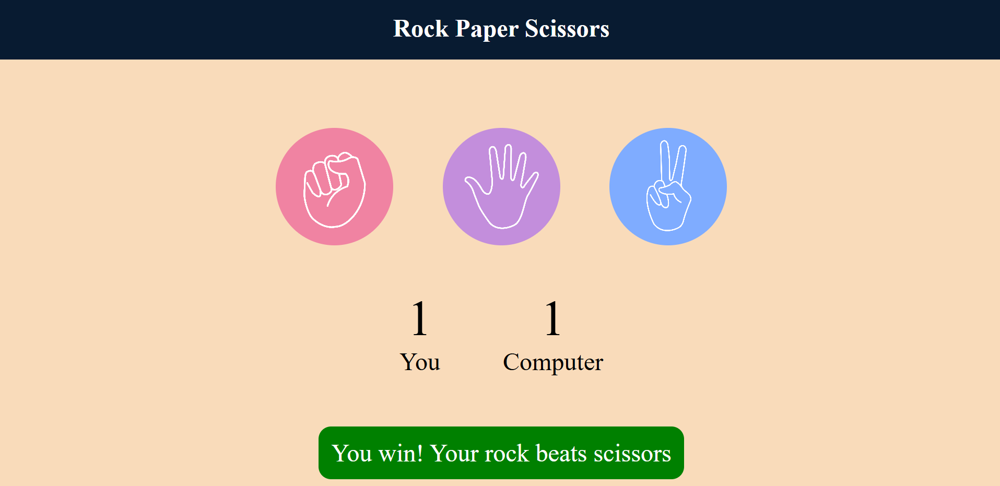

# ✊🖐✌️ Rock-Paper-Scissors Game

A simple interactive **Rock-Paper-Scissors** game built using **HTML**, **CSS**, and **JavaScript**. The user competes against the computer with randomly generated choices.

---

## 📸 Screenshot

---

## 🚀 Features

- 🧠 Computer chooses randomly each round
- 🧍 User selects Rock, Paper, or Scissors
- 🔁 Keeps track of current round winner
- 🎯 Highlights results with colors and text
- 🎨 Clean and responsive UI

---

## 🛠️ Technologies Used

- HTML5
- CSS3
- JavaScript (ES6)

---

## 🧩 How to Play

1. Click on **Rock**, **Paper**, or **Scissors**.
2. The computer will make a random choice.
3. The winner is shown with a message.
4. Keep playing and refresh to restart!

---

## 🛠️ Run Locally

1. Clone the repo:
   git clone https://github.com/anreja-manav/Rock-Paper-Scissors.git

2. Open the project folder:
    cd Rock-Paper-Scissors

3. Open index.html in your browser to play.
